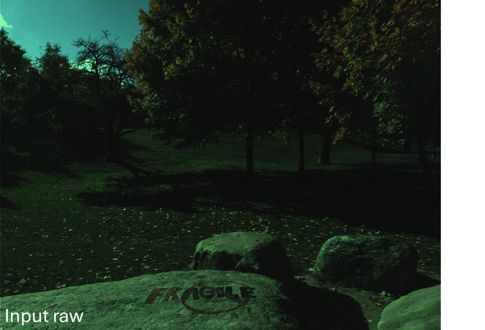

# ✨ Raw Image Enhancement

As explained in the main [paper](https://arxiv.org/abs/2512.08564) (Sec. 2.1), we perform raw image enhancement as the first stage of our pipeline.  
Specifically, we focus on raw image denoising, implemented as a learnable neural network.
<p align="center">
  
</p>

---

## ⚙️ Training

We provide trained models for the S24 dataset as well as generic models in the [`models`](models) directory. To re-train the denoising models, read the instructions below:


### Preprocessing

Since loading 16-bit full-resolution raw images (12 MP) causes significant I/O bottlenecks during training, we patchify the training images. Specifically:

- We use [`data-preparation/make_patch.py`](data-preparation/make_patch.py)  
- We create non-overlapping 512×512 patches and store them under directory names ending with `*_patches_512`.

For the [Zurich dataset](https://aiff22.github.io/pynet.html#dataset), patchifying is *not* needed, as the dataset already provides 448×448 raw crops.  
See the [`datasets/`](../datasets) directory for more information about dataset preparation.


### Camera-Specific Models

For [S24](https://github.com/mahmoudnafifi/time-aware-awb/tree/main/s24-raw-srgb-dataset) and [Adobe 5K](https://data.csail.mit.edu/graphics/fivek/), choose a model size `[lite/base/large]` and dataset name `[s24/adobe-5k]` after patchifying:

```bash
python training.py \
    --exp_name [s24/adobe-5k] \
    --model_size [lite/base/large] \
    --path_gt path/to/train/set/denoised_raw_images_patches_512 \
    --path_lq path/to/train/set/raw_images_patches_512 \
    --path_metadata path/to/train/set/data

```
For Zurich, where patchifying is unnecessary:
```bash 
python training.py \
    --exp_name zurich \
    --model_size [lite/base/large] \
    --path_gt path/to/train/set/denoised_raw_images \
    --path_lq path/to/train/set/raw_images \
    --path_metadata path/to/train/set/data
```

### Generic Model

We also trained a "generic" cross-camera denoising model using a hybrid [S24](https://github.com/mahmoudnafifi/time-aware-awb/tree/main/s24-raw-srgb-dataset) dataset.  
Each training pair (clean, noisy) is sampled from one of the following:

- (clean, clean)  
- (clean, real noisy)  
- (clean, synthetic noisy)

`--synth_noise` enables synthetic noise generation.  
The ratio of these three pair types is controlled via `--sampling_rates`.

The ISO-dependent synthetic noise model uses ground-truth ISO values from metadata when `--use_original_iso` is enabled.

Example:

```bash
python training.py \
    --exp_name generic \
    --model_size [lite/base/large] \
    --path_gt path/to/train/set/denoised_raw_images_patches_512 \
    --path_lq path/to/train/set/raw_images_patches_512 \
    --path_metadata path/to/train/set/data \
    --synth_noise \
    --use_original_iso
```

---

### 🤝 Acknowledgement

We thank Luxi Zhao for contributing to the development of the generic denoiser, and Raghav Goyal for his support during the early stages of the denoiser development.

---

### ✉️ Inquiries

For inquiries related to the denoising stage and its ablation studies, please contact Zhongling Wang (z.wang2@samsung.com).

