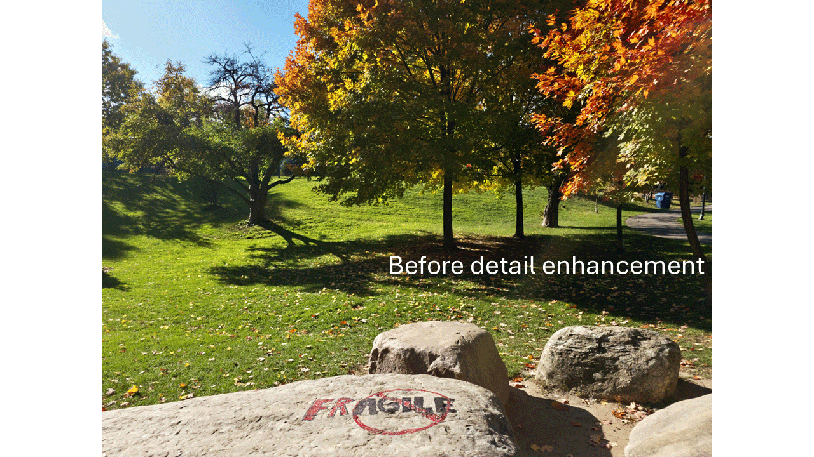

# 🪄 Detail Enhancement

After upsampling the output of the photofinishing module, we apply a detail-enhancement step implemented using a conv net. This step refines both local details and color fidelity in the final display-referred image (see Sec. 2.5 of the [paper](https://arxiv.org/abs/2512.08564) for details).

<p align="center">
  
</p>

---

## ⚙️ Training

We provide trained models for all styles (including the default style) of the [S24 dataset](https://github.com/mahmoudnafifi/time-aware-awb/tree/main/s24-raw-srgb-dataset) in the [`models`](models) directory.  
Re-training the detail-enhancement network requires pre-trained denoising model(s) and a pre-trained photofinishing network. To train a detail-enhancement model, use [`train.py`](train.py).  
Below is an example command:

```bash
python train.py \
    --in-training-dir path/to/training/raw/image/folder \
    --gt-training-dir path/to/training/sRGB/GT/image/folder \
    --data-training-dir path/to/training/metadata/folder \   # optional; defaults to "data" folder in the same directory as in-training-dir
    --in-validation-dir path/to/validation/raw/image/folder \
    --gt-validation-dir path/to/validation/sRGB/GT/image/folder \
    --data-validation-dir path/to/validation/metadata/folder \   # optional; defaults to "data" folder in the same directory as in-validation-dir
    --photofinishing-model-path path/to/pre-trained/photofinishing/module \
    --denoising-model-path path/to/denoiser1 path/to/denoiser2 ...   # minimum: one model
```
This command first processes the raw images using the provided denoising model(s) and the photofinishing model.  
If multiple denoisers are supplied, the pipeline generates multiple augmented copies of each image (one per denoiser).

This results in a paired dataset of patches, where each pair consists of:

- the pre-detail-enhancement output (after photofinishing and upsampling), and  
- the corresponding sRGB ground-truth patch.

Use `--in-size` to specify the patch size.  
Use `--no-downsampling` to disable the downsampling step before photofinishing (and therefore skip the guided upsampling afterward).

Before training, the generated paired data are stored on disk as HDF5 (`.h5`) files inside a temporary folder whose name begins with `en_temp_h5`, located in the root directory of the training data. You may change this prefix using `--temp-folder`.  The remainder of the folder name is automatically derived from the batch size, denoising, and photofinishing model filenames.

If a temporary folder already exists, the script will automatically skip regenerating the data, and you can use `--overwrite-temp-folder` to force deletion and full regeneration when the previous run was incomplete or corrupted.

To automatically delete the temporary folder after training, use `--delete-temp-folder`.

See [`train.py`](train.py) for additional useful arguments.


---

### ✉️ Inquiries
For inquiries related to the detail-enhancement stage, please contact Mahmoud Afifi (m.3afifi@gmail.com).
